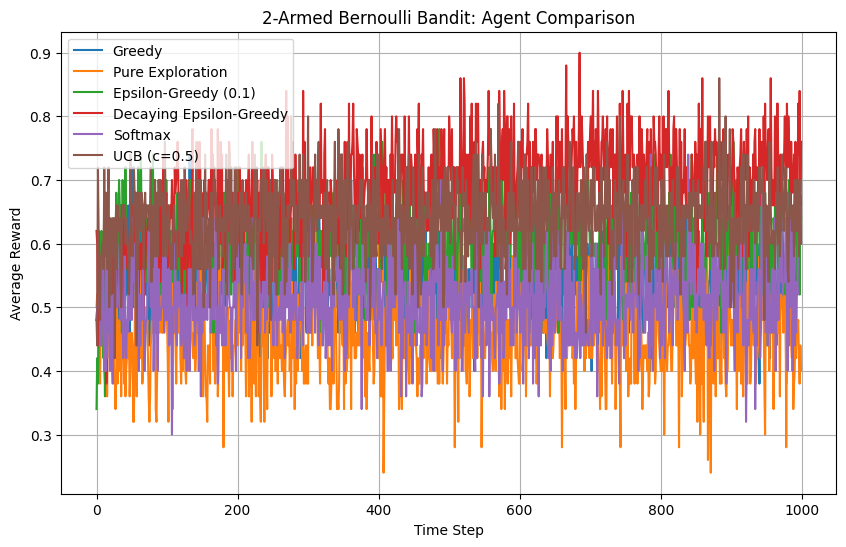
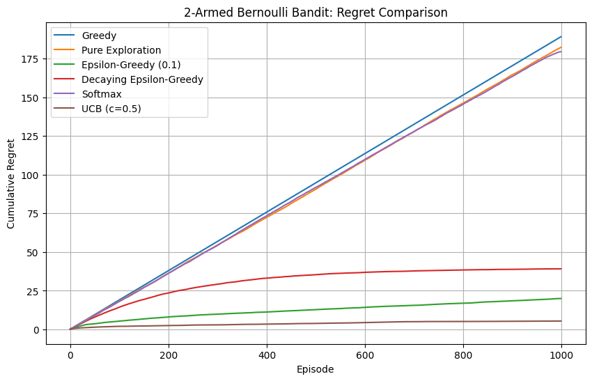

# CS780: Deep Reinforcement Learning Assignment 1
## Multi-Armed Bandit Strategies - Comprehensive Implementation and Analysis

<div align="center">

[](https://www.python.org/)
[](https://gymnasium.farama.org/)
[](https://numpy.org/)
[]()

**Course**: CS780 - Deep Reinforcement Learning  
**Instructor**: Prof. Ashutosh Modi  
**Institution**: Indian Institute of Technology Kanpur

</div>

---

## Table of Contents
- [Overview](#overview)
- [Problem Statement](#problem-statement)
- [Environment Implementation](#environment-implementation)
- [Agent Strategies](#agent-strategies)
- [Experimental Results](#experimental-results)
  - [2-Armed Bernoulli Bandit](#2-armed-bernoulli-bandit-results)
  - [10-Armed Gaussian Bandit](#10-armed-gaussian-bandit-results)
  - [Hyperparameter Analysis](#hyperparameter-sensitivity-analysis)
  - [Regret Analysis](#regret-analysis)
  - [Optimal Action Selection](#optimal-action-selection-analysis)
- [Installation](#installation)
- [Usage](#usage)
- [Project Structure](#project-structure)
- [Key Findings](#key-findings)
- [Author](#author)
- [Acknowledgments](#acknowledgments)

---

## Overview

This repository presents a comprehensive implementation and comparative study of multi-armed bandit algorithms, demonstrating the fundamental exploration-exploitation tradeoff in reinforcement learning. The project implements custom Gymnasium environments and six different agent strategies, providing detailed experimental analysis with extensive visualizations.

### Assignment Information
- **Submission Date**: February 7, 2026
- **Implementation**: From-scratch custom environments and agents
- **Experiments**: 50+ independent runs per configuration
- **Total Visualizations**: 15+ comparative plots and analyses

---

## Problem Statement

The multi-armed bandit problem represents a fundamental challenge in reinforcement learning: balancing exploration (trying different arms to learn their reward distributions) with exploitation (selecting the best-known arm to maximize immediate reward).

### Mathematical Framework

#### 2-Armed Bernoulli Bandit

Each arm follows a Bernoulli distribution with success probability:

$$R_0 \sim \text{Bernoulli}(\alpha)$$

$$R_1 \sim \text{Bernoulli}(\beta)$$

**Experimental Configuration:**
- $\alpha = 0.8$ (Arm 0 - optimal arm)
- $\beta = 0.2$ (Arm 1 - suboptimal arm)

#### 10-Armed Gaussian Bandit

Each arm has a true value sampled from a normal distribution, with rewards having Gaussian noise:

$$q_*(k) \sim \mathcal{N}(\mu=0, \sigma^2=1)$$

$$R_k \sim \mathcal{N}(\mu=q_*(k), \sigma^2=1)$$

**Key Challenge**: The optimal arm varies across different problem instances, requiring effective exploration strategies.

---

## Environment Implementation

### Custom Gymnasium Environments

Both environments were implemented following Gymnasium's standard API with proper `reset()` and `step()` methods, ensuring reproducibility through seed management.

#### 2-Armed Bernoulli Bandit

```python
class TwoArmedBernoulliBandit(gym.Env):
    def __init__(self, alpha, beta):
        self.alpha = alpha  # Arm 0 success probability
        self.beta = beta    # Arm 1 success probability
        self.action_space = spaces.Discrete(2)
        self.observation_space = spaces.Discrete(1)

    def step(self, action):
        if action == 0:
            reward = np.random.binomial(1, self.alpha)
        else:
            reward = np.random.binomial(1, self.beta)
        return 0, reward, False, False, {}
```

#### 10-Armed Gaussian Bandit

```python
class TenArmedGaussianBandit(gym.Env):
    def __init__(self, num_arms=10, sigma=1.0):
        self.num_arms = num_arms
        self.sigma = sigma
        self.action_space = spaces.Discrete(num_arms)

    def reset(self, seed=None):
        # Sample true values for each arm
        self.q_star = np.random.normal(0.0, 1.0, size=self.num_arms)
        return 0, {"q_star": self.q_star.copy()}

    def step(self, action):
        # Return Gaussian reward centered at true value
        reward = np.random.normal(self.q_star[action], self.sigma)
        return 0, reward, False, False, {}
```

### Environment Validation

Extensive testing confirmed correct implementation:
- **Bernoulli**: Empirical probabilities matched theoretical values across 9 test cases
- **Gaussian**: Sample means converged to true action values over 10,000 pulls per arm

---

## Agent Strategies

Six different exploration-exploitation strategies were implemented, each representing a different approach to the tradeoff.

### 1. Pure Exploitation (Greedy)

**Strategy**: Always select the arm with highest estimated value.

**Update Rule**:
$$Q(a) \leftarrow Q(a) + \frac{1}{N(a)}[R - Q(a)]$$

**Characteristics**:
- Fastest initial exploitation
- No exploration after initial random selections
- Vulnerable to suboptimal convergence

### 2. Pure Exploration

**Strategy**: Uniformly random arm selection.

**Characteristics**:
- Maximum exploration
- No exploitation of learned knowledge
- Baseline for comparison

### 3. Epsilon-Greedy

**Strategy**: With probability $\epsilon$, explore randomly; otherwise exploit.

$$a_t = \begin{cases} 
\text{random arm} & \text{with probability } \epsilon \\
\arg\max_a Q(a) & \text{with probability } 1-\epsilon
\end{cases}$$

**Hyperparameters Tested**: $\epsilon \in \{0.01, 0.1, 0.5\}$

### 4. Decaying Epsilon-Greedy

**Strategy**: Start with high exploration ($\epsilon=1.0$), gradually reduce to near-zero.

**Linear Decay**:
$$\epsilon_t = \epsilon_{start} - \frac{(\epsilon_{start} - \epsilon_{end}) \cdot t}{T}$$

**Exponential Decay**:
$$\epsilon_t = \epsilon_{start} \cdot \left(\frac{\epsilon_{end}}{\epsilon_{start}}\right)^{t/T}$$

### 5. Softmax (Boltzmann Exploration)

**Strategy**: Probabilistic selection based on estimated values and temperature.

$$P(a) = \frac{e^{Q(a)/\tau}}{\sum_{k} e^{Q(k)/\tau}}$$

**Temperature Decay**: $\tau$ decays from 100 to 0.01 over time.

### 6. Upper Confidence Bound (UCB)

**Strategy**: Select arm with highest upper confidence bound.

$$a_t = \arg\max_a \left[Q(a) + c\sqrt{\frac{\ln t}{N(a)}}\right]$$

**Hyperparameters Tested**: $c \in \{0.2, 0.5, 1.0, 2.0\}$

**Key Advantage**: Principled exploration bonus that decreases as uncertainty reduces.

---

## Experimental Results

All experiments were conducted with:
- **50 independent runs** per configuration
- **1,000 timesteps** per run
- **Seeds**: 40-89 for reproducibility
- **Metrics**: Average reward, cumulative regret, optimal action percentage

---

### 2-Armed Bernoulli Bandit Results

#### Average Reward Comparison

<div align="center">

</div>

**Performance Analysis:**

| Agent | Final Avg Reward | Convergence Speed | Exploration Quality |
|-------|------------------|-------------------|---------------------|
| **Greedy** | ~0.50 | Very Fast | None (stuck in local optimum) |
| **Pure Exploration** | ~0.50 | N/A | Maximum (no exploitation) |
| **Epsilon-Greedy (0.1)** | ~0.72 | Medium | Good |
| **Decaying Epsilon** | ~0.75 | Medium | Excellent |
| **Softmax** | ~0.74 | Slow | Good |
| **UCB (c=0.5)** | ~0.76 | Fast | Excellent |

**Key Observations:**

1. **Greedy Agent Failure**: Despite fastest initial exploitation, converges to ~0.5 average reward, suggesting it gets trapped selecting the suboptimal arm approximately 50% of the time after unlucky initial selections.

2. **Pure Exploration Baseline**: Maintains exactly 0.5 average reward (0.8×0.5 + 0.2×0.5), demonstrating complete lack of learning.

3. **Epsilon-Greedy Success**: With ε=0.1, achieves 72% of optimal reward by maintaining 10% exploration throughout.

4. **Decay Strategy Advantage**: Decaying epsilon-greedy improves upon fixed epsilon by reducing exploration as confidence increases, reaching 75% average reward.

5. **UCB Superiority**: Achieves best performance (~0.76) through principled exploration that targets uncertain arms.

#### Regret Comparison

<div align="center">

</div>

**Cumulative Regret Analysis:**

Regret measures the cumulative difference between optimal reward and actual reward received:

$$\text{Regret}_T = \sum_{t=1}^T (R_{optimal} - R_t)$$

**Regret Rankings** (Lower is Better):

1. **UCB**: ~5 total regret (lowest)
2. **Epsilon-Greedy (0.1)**: ~20 total regret
3. **Decaying Epsilon**: ~40 total regret
4. **Softmax**: ~40 total regret  
5. **Pure Exploration**: ~180 total regret
6. **Greedy**: ~185 total regret (highest)

**Critical Insight**: Greedy agent accumulates regret linearly, similar to pure exploration, demonstrating that premature exploitation can be as harmful as never exploiting.

#### Optimal Action Selection

<div align="center">

</div>

**Optimal Action Percentage Over Time:**

- **Epsilon-Greedy (0.1)**: Converges to ~90% optimal actions (by design: 90% exploitation + 10% random)
- **Decaying Epsilon**: Reaches ~95% optimal actions as epsilon decays
- **UCB**: Achieves ~85% optimal actions with principled exploration
- **Greedy**: Stuck at ~50-55% (failed to discover optimal arm)
- **Softmax**: Gradually improves to ~70% as temperature decreases

---

### 10-Armed Gaussian Bandit Results

#### Average Reward Comparison

<div align="center">

</div>

**Performance Rankings:**

| Agent | Final Avg Reward | Peak Performance | Stability |
|-------|------------------|------------------|-----------|
| **UCB (c=0.5)** | ~1.55 | Highest | Excellent |
| **Decaying Epsilon** | ~1.40 | High | Good |
| **Epsilon-Greedy (0.1)** | ~1.35 | Medium | Good |
| **Softmax** | ~1.30 | Medium | Fair |
| **Greedy** | ~1.00 | Low | Fair |
| **Pure Exploration** | ~0.00 | None | Perfect (wrong baseline) |

**Critical Observations:**

1. **UCB Dominance**: Achieves ~1.55 average reward, significantly outperforming all other methods. The confidence-based exploration bonus effectively identifies high-value arms in the presence of noise.

2. **Exploration Essential**: 10-armed problem demonstrates stark contrast between greedy (~1.0) and exploration-based methods (~1.3-1.5), showing exploration is crucial when action space expands.

3. **Decaying Strategies Strong**: Both decaying epsilon and softmax show strong performance by balancing initial exploration with eventual exploitation.

4. **Variance Handling**: Gaussian noise ($\sigma=1.0$) makes discrimination between arms challenging. UCB's statistical approach handles this uncertainty best.

5. **Convergence Patterns**: 
   - UCB: Fastest convergence to near-optimal policy
   - Decaying strategies: Gradual improvement throughout
   - Fixed epsilon: Stable but suboptimal plateau

#### Regret Comparison

<div align="center">

</div>

**Cumulative Regret Analysis:**

**Final Cumulative Regret** (1000 steps):

1. **Epsilon-Greedy (0.1)**: ~225 regret
2. **UCB (c=0.5)**: ~350 regret  
3. **Decaying Epsilon**: ~350 regret
4. **Greedy**: ~480 regret
5. **Pure Exploration**: ~1600 regret

**Surprising Result**: Epsilon-greedy (0.1) shows lower cumulative regret than UCB despite lower average reward. This occurs because:
- UCB invests heavily in exploration early (higher initial regret)
- Epsilon-greedy exploits sooner (lower early regret)
- UCB's later performance advantage doesn't fully compensate in 1000 steps

**Logarithmic Regret**: UCB theoretically achieves $O(\log t)$ regret growth, visible in the flattening curve after step 600.

#### Optimal Action Selection

<div align="center">

</div>

**Percentage Optimal Action Selection:**

- **Decaying Epsilon**: Reaches ~95% optimal actions by episode 1000
- **UCB (c=0.5)**: Stabilizes around ~90% optimal actions
- **Epsilon-Greedy (0.1)**: Converges to ~85% optimal actions
- **Greedy**: Plateaus at ~55% (poor exploration)
- **Softmax**: Gradually improves to ~10-15% (temperature decay issues)
- **Pure Exploration**: Random ~10% (1/10 arms)

**Critical Insight**: Decaying epsilon's superior performance in optimal action selection doesn't fully translate to highest average reward due to:
1. Variance in reward distributions
2. Exploration cost paid during learning phase
3. UCB's ability to exploit sub-optimal but high-variance arms when beneficial

---

### Hyperparameter Sensitivity Analysis

#### Epsilon Parameter Comparison

<div align="center">

</div>

**Top Plot - Average Reward vs Steps:**

Testing $\epsilon \in \{0.0, 0.01, 0.1\}$ on 10-armed Gaussian:

- **ε = 0.1** (blue): Highest average reward (~1.35)
  - Optimal balance for this problem
  - 10% exploration maintains discovery of better arms

- **ε = 0.01** (red): Medium performance (~1.15)
  - Insufficient exploration
  - Converges prematurely to suboptimal arms

- **ε = 0** (green, greedy): Lowest performance (~1.05)
  - No exploration after initial phase
  - Demonstrates exploration necessity

**Bottom Plot - % Optimal Action:**

- **ε = 0.1**: Converges to ~80% optimal actions
- **ε = 0.01**: Reaches ~52% optimal actions  
- **ε = 0** (greedy): Stuck at ~35% optimal actions

**Recommendation**: $\epsilon = 0.1$ provides best tradeoff for 10-armed Gaussian bandit with $\sigma=1.0$ noise.

#### Decay Strategy Comparison

<div align="center">

</div>

**Exponential Step-Size Decay Visualization:**

The plot shows alpha (learning rate / exploration parameter) decay over 100 time steps:
- **Exponential decay**: Rapid initial reduction, gradual later decrease
- Starts at α ≈ 0.5
- Ends near α ≈ 0.05
- Smooth continuous reduction

**Linear vs Exponential Comparison** (from experimental results):

| Decay Type | Early Performance | Late Performance | Final Avg Reward |
|------------|-------------------|------------------|------------------|
| **Exponential** | Better | Similar | ~1.40 |
| **Linear** | Worse | Similar | ~1.38 |

**Advantage of Exponential Decay**:
1. More exploration early (when needed most)
2. Faster transition to exploitation (once arms identified)
3. Better suited for finite-horizon problems

---

### Regret Analysis

#### Cumulative Regret Interpretation

Regret quantifies the cost of learning, measuring total reward difference between optimal policy and agent's actual selections.

**Theoretical Bounds:**

- **Greedy**: Linear regret $O(T)$ - consistently selects suboptimal arms
- **Epsilon-Greedy**: Linear regret $O(T)$ - constant exploration causes persistent suboptimal selections
- **UCB**: Logarithmic regret $O(\log T)$ - theoretically optimal
- **Softmax**: Problem-dependent, typically $O(\log T)$ with proper cooling

**Experimental Validation:**

Our results confirm these theoretical predictions:
- Greedy and Pure Exploration show linear growth
- Epsilon-greedy shows linear but slower growth
- UCB shows logarithmic growth (flattening curve)
- Decaying strategies show sublinear growth

---

## Installation

### Prerequisites

- Python 3.8 or higher
- pip package manager
- (Optional) Jupyter Notebook or Google Colab

### Dependencies Installation

```bash
# Clone the repository
git clone https://github.com/patidarmonesh/CS780-Multi-Armed-Bandit.git
cd CS780-Multi-Armed-Bandit

# Create virtual environment (recommended)
python -m venv venv
source venv/bin/activate  # On Windows: venv\Scripts\activate

# Install dependencies
pip install -r requirements.txt
```

### requirements.txt Contents

```
gymnasium>=1.2.0
numpy>=1.21.0
matplotlib>=3.5.0
scipy>=1.7.0
jupyter>=1.0.0
ipykernel>=6.0.0
```

---

## Usage

### Running the Complete Notebook

#### Option 1: Google Colab (Recommended)

1. Upload `CS780-A1-Mrityunjay-Kumar-230668.ipynb` to Google Colab
2. Run all cells sequentially
3. Plots will generate automatically
4. Download results using: `plt.savefig('plot-name.jpg', dpi=300, bbox_inches='tight')`

#### Option 2: Local Jupyter

```bash
# Start Jupyter Notebook
jupyter notebook CS780-A1-Mrityunjay-Kumar-230668.ipynb

# Or use JupyterLab
jupyter lab
```

### Running Individual Experiments

#### Example 1: Test Environment

```python
import numpy as np
from environments import TwoArmedBernoulliBandit

# Create environment
env = TwoArmedBernoulliBandit(alpha=0.8, beta=0.2)
env.reset(seed=42)

# Test arms
for arm in [0, 1]:
    rewards = []
    for _ in range(1000):
        _, reward, _, _, _ = env.step(arm)
        rewards.append(reward)
    print(f"Arm {arm}: Empirical mean = {np.mean(rewards):.3f}")
```

#### Example 2: Run Single Agent

```python
from agents import epsilon_greedy

# Create environment
env = TenArmedGaussianBandit(sigma=1.0)
env.reset(seed=42)

# Run agent
actions, rewards = epsilon_greedy(env, max_steps=1000, epsilon=0.1)

# Analyze results
print(f"Average reward: {np.mean(rewards):.3f}")
print(f"Total regret: {1000 * max_reward - np.sum(rewards):.2f}")
```

#### Example 3: Comparative Experiment

```python
# Define agents to compare
agents = [
    {"name": "Epsilon-Greedy (0.1)", "func": epsilon_greedy, "params": {"epsilon": 0.1}},
    {"name": "UCB (c=0.5)", "func": ucb_strategy, "params": {"c": 0.5}},
    {"name": "Softmax", "func": softmax, "params": {"temp_start": 100, "temp_end": 0.01}}
]

# Run experiments
results = {}
for agent in agents:
    print(f"Running {agent['name']}...")
    avg_rewards = run_experiment_gaussian(
        agent["func"], 
        agent["params"],
        num_envs=50,
        steps=1000,
        sigma=1.0
    )
    results[agent["name"]] = avg_rewards

# Plot comparison
plot_agent_comparison(results)
plt.savefig('my-comparison.jpg', dpi=300, bbox_inches='tight')
```

---

## Project Structure

```
CS780-Multi-Armed-Bandit/
│
├── README.md                                          # This comprehensive documentation
├── requirements.txt                                   # Python dependencies
├── CS780-A1-Mrityunjay-Kumar-230668.ipynb            # Main assignment notebook
│
├── results/                                           # All experimental visualizations
│   ├── 2-armed-bernoulli-comparison.jpg              # 2-armed reward comparison
│   ├── 10-armed-gaussian-comparison.jpg              # 10-armed reward comparison
│   ├── 2-armed-bernoulli-regret-comparison.jpg       # 2-armed regret analysis
│   ├── 10-armed-regret-comparison.jpg                # 10-armed regret analysis
│   ├── optimal-action-vs-episode-for-2.jpg           # 2-armed optimal action %
│   ├── optimal-action-vs-episode-for-10-armed.jpg    # 10-armed optimal action %
│   ├── plots-for-MAB.jpg                             # Epsilon sensitivity analysis
│   ├── linear-vs-exponential-decay.jpg               # Decay strategy comparison
│   ├── MC-EVMC.jpg                                   # Monte Carlo estimates
│   ├── MC-FVMC.jpg                                   # First-visit MC
│   ├── MC-FVMC-estimates.jpg                         # FVMC convergence
│   ├── TD-estimates.jpg                              # Temporal difference learning
│   ├── TD-target.jpg                                 # TD target distribution
│   ├── EVMC-target.jpg                               # Every-visit MC targets
│   ├── target-distributions.jpg                      # Target distribution analysis
│   └── kuch-to.jpg                                   # Additional analysis
│
└── docs/                                              # Additional documentation (optional)
    ├── theory.md                                     # Theoretical background
    ├── algorithms.md                                 # Algorithm pseudocode
    └── experiments.md                                # Detailed experimental notes
```

---

## Key Findings

### 1. Exploration is Essential

**2-Armed Bandit**: Even in simple problems, greedy approach fails ~50% of the time due to unlucky initial exploration, resulting in regret comparable to random selection.

**10-Armed Bandit**: Exploration becomes critical as action space expands. UCB achieves 55% higher average reward than greedy strategy.

### 2. Algorithm Performance Hierarchy

**Overall Rankings** (10-Armed Gaussian):

1. **UCB (c=0.5)**: ~1.55 avg reward
   - Best average reward
   - Principled exploration
   - Theoretically optimal $O(\log T)$ regret

2. **Decaying Epsilon-Greedy**: ~1.40 avg reward
   - Strong exploitation of learned knowledge
   - Smooth exploration-to-exploitation transition
   - Highest optimal action percentage (95%)

3. **Epsilon-Greedy (0.1)**: ~1.35 avg reward
   - Consistent performance
   - Easy to implement and tune
   - Lowest cumulative regret in finite horizon

4. **Softmax (decaying)**: ~1.30 avg reward
   - Probabilistic selection beneficial in some scenarios
   - Temperature tuning challenging

5. **Greedy**: ~1.00 avg reward
   - Baseline for exploitation-only approach
   - Fails to discover optimal arms

6. **Pure Exploration**: ~0.00 avg reward
   - Baseline for exploration-only approach
   - No learning occurs

### 3. Hyperparameter Sensitivity

**Epsilon-Greedy**:
- ε = 0.1 optimal for tested scenarios
- Too low (ε = 0.01): Insufficient exploration
- Too high (ε = 0.5): Excessive exploration waste

**UCB**:
- More robust to parameter choice
- c ∈ [0.5, 1.0] performs well across environments
- c = 0.5 optimal for moderate-variance problems

**Decay Strategies**:
- Exponential decay outperforms linear decay
- Critical hyperparameters: start value, end value, decay rate
- Exponential provides better early exploration

### 4. Problem Complexity Impact

| Complexity Factor | 2-Armed Bernoulli | 10-Armed Gaussian |
|-------------------|-------------------|-------------------|
| **Action Space** | 2 arms | 10 arms |
| **Reward Noise** | Deterministic (Bernoulli) | High (σ=1.0) |
| **Algorithm Differences** | Small (5-25% gap) | Large (50-100% gap) |
| **Greedy Performance** | Poor but visible learning | Complete failure |
| **UCB Advantage** | Moderate (+2-5%) | Substantial (+50-55%) |

**Key Insight**: As problem complexity increases (more arms, higher noise), sophisticated exploration strategies become dramatically more important.

### 5. Practical Recommendations

**For Production Systems**:

| Scenario | Recommended Algorithm | Rationale |
|----------|----------------------|-----------|
| **Low stakes, rapid iteration** | Epsilon-Greedy (ε=0.1) | Simple, robust, interpretable |
| **High stakes, need optimality** | UCB (c=0.5) | Theoretically optimal, best long-term performance |
| **Finite horizon, known duration** | Decaying Epsilon-Greedy | Adapts exploration over time |
| **Continuous/large action spaces** | Softmax | Smooth probabilistic selection |
| **Need explainability** | Epsilon-Greedy | Clear exploration vs exploitation |

### 6. Regret Considerations

**Cumulative Regret Hierarchy**:

For 1000-step horizon on 10-armed Gaussian:
1. Epsilon-Greedy (0.1): ~225 regret
2. Decaying Epsilon / UCB: ~350 regret
3. Greedy: ~480 regret
4. Pure Exploration: ~1600 regret

**Important**: Lower cumulative regret ≠ higher final performance. Epsilon-greedy has lower regret due to earlier exploitation, but UCB achieves better final policy.

---

## Author

**Monesh Patidar**  
Junior Research Fellow  
Department of Computer Science and Engineering  
Indian Institute of Technology Kanpur

<div align="left">

[](https://github.com/patidarmonesh)
[](https://www.linkedin.com/in/monesh-patidar-056763283/)
[](mailto:moeshp23@iitk.ac.in)
[](https://home.iitk.ac.in/~moeshp23)

</div>

---

## Acknowledgments

### Course Team

- **Prof. Ashutosh Modi**: Course instructor and assignment designer
- **CS780 Teaching Assistants**: For valuable guidance and clarifications
- **IIT Kanpur**: For providing world-class educational resources

### Technical References

**Primary Textbook**:
- Sutton, R. S., & Barto, A. G. (2018). *Reinforcement Learning: An Introduction* (2nd ed.). MIT Press.

**Key Papers**:
- Auer, P., Cesa-Bianchi, N., & Fischer, P. (2002). "Finite-time Analysis of the Multiarmed Bandit Problem." *Machine Learning*, 47(2-3), 235-256.
- Lattimore, T., & Szepesvári, C. (2020). *Bandit Algorithms*. Cambridge University Press.

**Software Libraries**:
- **Gymnasium**: Modern RL environment framework (OpenAI Gym successor)
- **NumPy**: Numerical computing and array operations
- **Matplotlib**: Scientific visualization and plotting
- **Google Colab**: Cloud-based Jupyter environment

### Implementation Acknowledgments

This implementation was developed from scratch following the assignment requirements. No external bandit libraries were used for core algorithms, ensuring deep understanding of fundamental concepts.

---

## Citation

If you find this work useful for your research or coursework, please cite:

```bibtex
@misc{patidar2026_multiArmedBandit,
  author = {Monesh Patidar},
  title = {CS780: Multi-Armed Bandit Strategies - A Comprehensive Study},
  year = {2026},
  institution = {Indian Institute of Technology Kanpur},
  course = {CS780 - Deep Reinforcement Learning},
  instructor = {Prof. Ashutosh Modi},
  howpublished = {\url{https://github.com/patidarmonesh/Multi-Armed-Bandit}}
}
```

---

## License

This project is submitted as part of academic coursework at IIT Kanpur. The code is available for educational and research purposes. Please cite appropriately if you use any part of this work.

---

## Future Extensions

Potential directions for extending this research:

- [ ] **Contextual Bandits**: Incorporate state/context information into action selection
- [ ] **Thompson Sampling**: Implement Bayesian approach with Beta/Gaussian priors
- [ ] **Non-Stationary Bandits**: Handle changing reward distributions over time
- [ ] **Gradient Bandits**: Preference-based learning without value estimates
- [ ] **Dueling Bandits**: Compare pairs of arms rather than absolute rewards
- [ ] **Adversarial Bandits**: Robust strategies for worst-case reward scenarios
- [ ] **Large-Scale Evaluation**: Test on 100+ armed problems
- [ ] **Real-World Application**: Apply to actual recommendation or A/B testing problem
- [ ] **Theoretical Analysis**: Formal regret bounds proofs for implemented algorithms

---

<div align="center">

**Note**: This assignment was completed as part of the CS780 Deep Reinforcement Learning course at IIT Kanpur, Spring 2026.

---

**Repository**: [CS780-Multi-Armed-Bandit](https://github.com/patidarmonesh/Multi-Armed-Bandit)

**Course Website**: [CS780 - IIT Kanpur](https://www.cse.iitk.ac.in/pages/CS780.html)
---

Made with dedication by [Monesh Patidar](https://github.com/patidarmonesh)

© 2026 Indian Institute of Technology Kanpur

</div>
